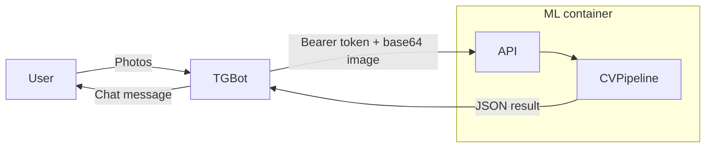

# Kolobok – Automated Tire Valuation Platform

[](LICENSE)
[](#)
[](docker-compose.yaml)
[](https://fastapi.tiangolo.com/)
[](#)

Kolobok is an end-to-end system that **estimates tread depth, spike wear and recognises tire make / model** from only two user photos.  A Telegram bot collects the images, a FastAPI service executes the computer-vision pipeline and a lightweight ML bundle runs the models.

---

## Table of contents
1. [Features](#features)
2. [Architecture](#architecture)
3. [Quick start](#quick-start)
4. [Configuration](#configuration)
5. [Project layout](#project-layout)
6. [API reference](#api-reference)
7. [Telegram bot UX](#telegram-bot-ux)
8. [License](#license)

---

## Features
* 📸 **Two-photo workflow** – side wall + tread.
* ⚙️ **Fully dockerised** – `docker-compose up` spins up everything.
* 🤖 **Telegram bot** for a friction-less user interface (Russian UI).
* 🧠 **CV & ML back-end**
  * Side-wall OCR → brand / model / size extraction
  * Tread-depth regression
  * Spike detector & classifier with visual annotations
* 🔐 **Token-based authentication** between bot and API.
* 🌩️ Optional GPU support.

## Architecture

Components:
* **`tg`** – Telegram bot (python-telegram-bot 20).
* **`ml`** – FastAPI app exposing the CV pipeline.

Both run inside Docker containers orchestrated by **docker-compose**.

## Quick start
```bash
# 1. Clone
git clone git@github.com:IU-Capstone-Project-2025/Kolobok.git
cd kolobok

# 2. Create env-file with the required variables (see below)
cp .env.example .env  # edit values

# 3. Build & start
docker-compose up --build
```
The ML API becomes available at `http://localhost:8000`, and the bot starts chatting from the account whose token you supplied.

## Configuration
Place all variables in `.env` (used by docker-compose):
| Variable | Purpose |
|----------|---------|
| `API_TOKEN` | Shared secret between bot and API |
| `BOT_TOKEN` | Telegram Bot-Father token |
| `APP_URL`   | Hostname of the API from inside *bot* container (default `ml:8000`) |
| `HF_TOKEN`  | 🤗 Hub auth for model downloads |
| `SPIKE_DETECTOR_CHECKPOINT` | Path / URL to YOLO (or alike) weights |
| `SPIKE_CLASSIFIER_CHECKPOINT` | Classifier weights |
| `DEPTH_ESTIMATOR_MODEL_NAME` | Hugging-Face model id |
| `DEPTH_ESTIMATOR_CHECKPOINT` | Fine-tuned weights |
| `DEVICE` | `cpu`, `cuda`, `cuda:0`, … |

> ⚠️  Ask `@NikitaMensh` for production values.

## Project layout
```text
ml/           # FastAPI + vision pipeline (Dockerised)
  ├─ tire_vision/   # Core CV code
  ├─ external/      # Third-party submodules (SAN etc.)
  └─ notebooks/     # Exploratory notebooks

tg/           # Production Telegram bot (used in docker-compose)
tg_bot/       # Legacy PoC bot (kept for reference)
frontend/     # (planned) Web dashboard
annotations/  # In-house annotation tooling
TireDataset/  # Raw & processed dataset structure
Design_Userflow/  # UX diagrams & screenshots
.vscode/      # Editor settings
```

## API reference
| Endpoint | Method | Payload | Returns |
|----------|--------|---------|---------|
| `/api/v1/analyze_thread` | POST | `{image: <base64>}` | `{thread_depth: float, spikes: [...], image: <base64 annotated PNG>}` |
| `/api/v1/extract_information` | POST | `{image: <base64>}` | `{tire_mark, tire_manufacturer, tire_diameter}` |
Authentication: `Authorization: Bearer <API_TOKEN>` header.

Interactive docs at `http://localhost:8000/docs` (FastAPI swagger).

## Telegram bot UX
1. User sends `/start` and enters **password** (`API_TOKEN`).
2. Chooses:
   * *Brand & model* – uploads side-view photo.
   * *Tread depth & spikes* – uploads tread photo.
3. Bot replies with structured results and offers to correct them.

Screenshots live in `Design_Userflow/`.

## License
MIT © Kolobok team
